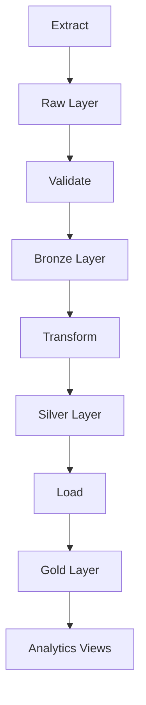

# 🚀 Pipeline de Dados - CAF

Este projeto implementa um pipeline de dados utilizando a arquitetura Medallion, com processamento em camadas (raw, bronze, silver e gold) e orquestração via Apache Airflow.

## 🔄 Fluxo de Dados

1. 📥 Os dados são extraídos dos arquivos JSON e salvos na camada raw
2. ✅ Os dados são validados e movidos para a camada bronze
3. 🔄 As transformações são aplicadas e os dados são salvos na camada silver
4. 📤 Os dados são carregados no PostgreSQL na camada gold
5. 🎭 Todo o processo é orquestrado pelo Airflow
6. 📊 Metadados são gerados e armazenados em cada etapa

## 🏗️ Arquitetura

### 📊 Diagrama do Pipeline



### 🏺 Camadas do Medallion

1. **Raw Layer** 🗃️
   - Primeira camada de ingestão
   - Armazena dados brutos sem transformações
   - Formato: Parquet
   - Mantém a estrutura original dos dados
   - Objetivo: Preservar dados originais para reprocessamento
   - **Arquivos de entrada**:
     - `data/users.json`
     - `data/customers.json`
     - `data/transactions.json`
   - **Arquivos de saída**:
     - `data/parquet/raw/users_[timestamp].parquet`
     - `data/parquet/raw/customers_[timestamp].parquet`
     - `data/parquet/raw/transactions_[timestamp].parquet`

2. **Bronze Layer** 🏆
   - Dados validados e limpos
   - Validação de schema usando Pydantic
   - Verificação de qualidade de dados
   - Formato: Parquet
   - Objetivo: Garantir integridade dos dados
   - **Arquivos de entrada**: Arquivos Parquet da camada raw
   - **Arquivos de saída**:
     - `data/parquet/bronze/users_[timestamp].parquet`
     - `data/parquet/bronze/customers_[timestamp].parquet`
     - `data/parquet/bronze/transactions_[timestamp].parquet`

3. **Silver Layer** 🥈
   - Dados transformados e enriquecidos
   - Transformações de negócio
   - Normalização de dados
   - Formato: Parquet
   - Objetivo: Preparar dados para análise
   - **Arquivos de entrada**: Arquivos Parquet da camada bronze
   - **Arquivos de saída**:
     - `data/parquet/silver/users_[timestamp].parquet`
     - `data/parquet/silver/customers_[timestamp].parquet`
     - `data/parquet/silver/transactions_[timestamp].parquet`

4. **Gold Layer** 🥇
   - Dados prontos para consumo
   - Modelo dimensional (Star Schema)
   - Views materializadas para análise
   - Formato: PostgreSQL
   - Objetivo: Suportar análises e relatórios
   - **Arquivos de entrada**: Arquivos Parquet da camada silver
   - **Arquivos de saída**:
     - Tabelas no PostgreSQL:
       - `gold.users`
       - `gold.customers`
       - `gold.transactions`

## 📁 Estrutura do Projeto

```
.
├── dags/                    # DAGs do Airflow
├── data/                    # Dados processados
│   ├── parquet/            # Arquivos Parquet
│   │   ├── raw/           # Camada Raw
│   │   ├── bronze/        # Camada Bronze
│   │   └── silver/        # Camada Silver
│   └── metadata/          # Metadados do pipeline
├── src/                    # Código fonte
│   ├── extractors/        # Extração de dados
│   ├── transformers/      # Transformação de dados
│   ├── validators/        # Validação de dados
│   ├── loaders/          # Carregamento de dados
│   └── utils/            # Utilitários
└── tests/                 # Testes
```

## ⚙️ Componentes do Pipeline

### 1. Extração (Extract) 📥
- **Responsabilidade**: Coleta dados de fontes externas
- **Tecnologias**: Python, Pandas
- **Componentes**:
  - `src/extractors/data_extractor.py`: Responsável por ler os arquivos JSON e converter para DataFrames
  - `src/storage/parquet_storage.py`: Gerencia o armazenamento em formato Parquet
- **Artefatos**: Arquivos JSON
- **Output**: Camada Raw

### 2. Validação (Validate) ✅
- **Responsabilidade**: Validação de schema e qualidade
- **Tecnologias**: Pydantic, Pandas
- **Componentes**:
  - `src/validators/data_validator.py`: Valida os dados contra schemas Pydantic
  - `src/validators/data_quality.py`: Realiza validações de qualidade
  - `src/utils/schemas.py`: Define os schemas Pydantic
- **Validações**:
  - Schema (tipos, campos obrigatórios)
  - Valores nulos
  - Valores únicos
  - Formato de dados
- **Output**: Camada Bronze

### 3. Transformação (Transform) 🔄
- **Responsabilidade**: Transformação e enriquecimento
- **Tecnologias**: Pandas
- **Componentes**:
  - `src/transformers/data_transformer.py`: Aplica transformações nos dados
  - `src/utils/schemas.py`: Define os schemas para validação pós-transformacao
- **Transformações**:
  - Normalização de campos
  - Cálculo de métricas
  - Enriquecimento de dados
  - Limpeza e padronização
- **Output**: Camada Silver

### 4. Carregamento (Load) 📤
- **Responsabilidade**: Carregamento no banco de dados
- **Tecnologias**: SQLAlchemy, PostgreSQL
- **Componentes**:
  - `src/loaders/gold_loader.py`: Gerencia o carregamento para o PostgreSQL
- **Operações**:
  - Upsert de dados
  - Atualização de views
  - Manutenção de índices
- **Output**: Camada Gold

### 5. Orquestração 🎭
- **Responsabilidade**: Coordenar a execução da pipeline
- **Componentes**:
  - `dags/caf_pipeline.py`: Define o DAG do Airflow
  - `src/utils/metadata.py`: Gerencia metadados da execução
- **Configuração**:
  - `docker-compose.yaml`: Configuração dos serviços
  - `Dockerfile`: Configuração do container Airflow
  - `entrypoint.sh`: Script de inicialização
  - `requirements.txt`: Dependências Python

## 📊 Modelo de Dados

### Schema Star ⭐
O modelo de dados segue o padrão Star Schema, com:

1. **Tabelas Fato** 📈
   - `gold.transactions`: Registros de transações
   - `gold.fraud_analysis`: Análise de fraudes
   - `gold.user_behavior`: Comportamento de usuários

2. **Tabelas Dimensão** 📐
   - `gold.users`: Dados de usuários
   - `gold.customers`: Dados de clientes

### Views Materializadas 👀

1. **gold.fraud_analysis** 🕵️
   - Análise de transações fraudulentas
   - Métricas de risco
   - Padrões de fraude

2. **gold.user_behavior** 👤
   - Comportamento de usuários
   - Padrões de uso
   - Métricas de engajamento

## ✅ Validações de Dados

### 1. User 👤
- **Validação de Email**:
  - Regex: `^[a-zA-Z0-9._%+-]+@[a-zA-Z0-9.-]+\.[a-zA-Z]{2,}$`
- **Campos Obrigatórios**:
  - `_id`
  - `name`
  - `email`
  - `createdAt`
  - `birthdate`

### 2. Customer 🏢
- **Validação de CNPJ**:
  - Verifica se tem exatamente 14 dígitos
  - Verifica se contém apenas números
- **Campos Obrigatórios**:
  - `_id`
  - `fantasyName`
  - `cnpj`
  - `status`
  - `segment`

### 3. Transaction 💰
- **Campos Obrigatórios**:
  - `_id`
  - `tenantId`
  - `userId`
  - `createdAt`
  - `updatedAt`
  - `favoriteFruit`
  - `isFraud`
  - `document`
- **Validação de Documento**:
  - Garante que é um dicionário válido

## 📝 Metadados

O pipeline mantém metadados detalhados:

1. **Execução** ⏱️
   - Timestamp
   - Status
   - Duração
   - Erros
   - **Arquivos**: `data/metadata/run_[uuid].json`

2. **Dados** 📊
   - Contagem de registros
   - Estatísticas
   - Qualidade
   - Transformações aplicadas

## 🛠️ Tecnologias

- **Orquestração**: Apache Airflow
- **Processamento**: Python, Pandas
- **Armazenamento**: Parquet, PostgreSQL
- **Validação**: Pydantic
- **Infraestrutura**: Docker, Docker Compose

## 🚀 Execução

1. **Setup Inicial**
```bash
docker-compose up -d
```

2. **Acesso ao Airflow** 🌐
- URL: http://localhost:8080
- Usuário: airflow
- Senha: airflow

3. **Monitoramento** 📊
- Logs no Airflow
- Metadados em `data/metadata`
- Métricas no PostgreSQL

## 🔧 Manutenção

1. **Backup** 💾
   - Dados em Parquet
   - Metadados em JSON
   - Scripts de recuperação

2. **Monitoramento** 👀
   - Logs do Airflow
   - Métricas do PostgreSQL
   - Alertas de erro

3. **Escalabilidade** 📈
   - Processamento distribuído
   - Particionamento de dados
   - Otimização de queries

